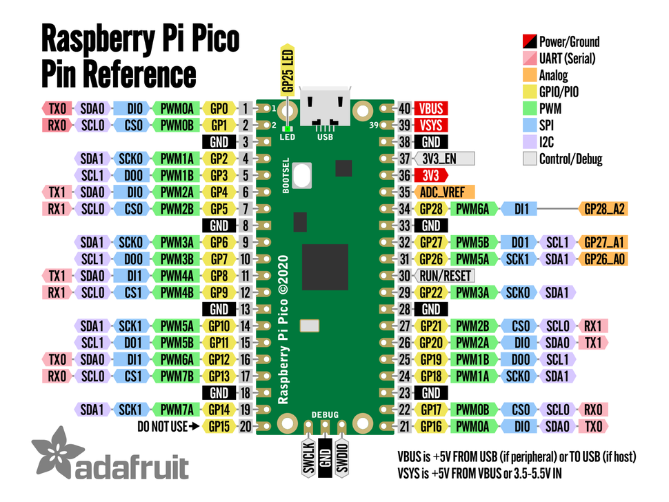
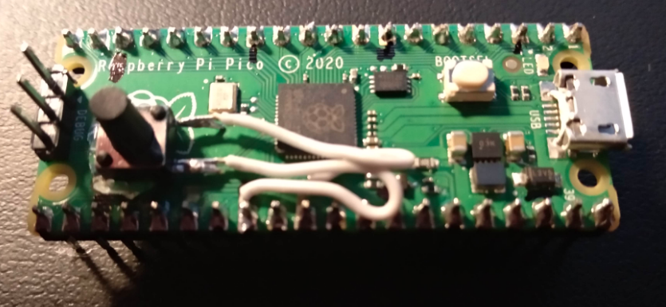

# Raspberry Pi Pico in Rust Proj Template with RTIC USB-Serial and UF2
A template for my Rust projects with Raspberry Pi Pico.

## Description

Hi, this is my starting project template for my developments in Embedded Rust with the Raspberry Pi Pico (rp2040 micro-controller).<br>
<br>

**It is a example of a program developed with:**
* The RTIC operating system or scheduler for ARM Micro-controllers.
* The USB-Serial emulation of a serial port, it can emulate other types of USB devices.
* Uf2 method of programming the Pico, but probe-run can also be used by uncommenting one line.
* It's an example of using shared and local state in RTIC.
* It's an example of using interrupts in RTIC.
* It's an example on processing the input from serial and sending a menu to serial terminal, printing long test, and format text with variables to serial terminal.
* It's an example of doing direct register access in Rust with PAC.
* It's an example of using the rp2040-hal.
* It's an example of using the rp-pico bsp abstraction layer.
<br>

I developed and tested this project in Linux Ubuntu 20.04, but it probably will compile and run in any computer (Linux, Windows, Mac and Raspberry Pi) connected to a Raspberry Pi Pico. This project feeds from several other projects. <br>
<br>

This project was made after studying all Rust Pico examples and the RTIC book. By starting with the [Project template for rp2040-hal](https://github.com/rp-rs/rp2040-project-template) configuring it to UF2 and changing it to suit my needs. I then added all the dependency libs for it to work with many of the examples of [rp-pico board in the rp-hal](https://github.com/rp-rs/rp-hal/tree/main/boards/rp-pico) and the examples in [rp2040-hal in the rp-hal](https://github.com/rp-rs/rp-hal/tree/main/rp2040-hal/examples). Then I started with the code from example [pico_rtic.rs](https://github.com/rp-rs/rp-hal/blob/main/boards/rp-pico/examples/pico_rtic.rs) and mixed it with the example [pico_usb_serial.rs](https://github.com/rp-rs/rp-hal/blob/main/boards/rp-pico/examples/pico_usb_serial.rs) and [pico_usb_serial_interrupt.rs](https://github.com/rp-rs/rp-hal/blob/main/boards/rp-pico/examples/pico_usb_serial_interrupt.rs)
but I couldn't make it all compile in RTIC. Then searched online for clues and arrived at Matrix chat room for the rp-hal [https://matrix.to/#/#rp-rs:matrix.org](https://matrix.to/#/#rp-rs:matrix.org). There I found a very warm and helpful community, that gave me links to examples of working USB in RTIC with Pico. Using this information I come up with this cool and useful (at least to me) project template. I extensively used the example that Paul Daniel Faria gave me - Nashenas88 - dactyl-manuform-kb2040-rs [https://github.com/Nashenas88/dactyl-manuform-kb2040-rs](https://github.com/Nashenas88/dactyl-manuform-kb2040-rs).


## RP-Pico Pinout




# Specifications RP-Pico Board:
* Low cost
* Dual core ARM Cortex M0 at 133 MHz that some people made it working at 420 MHZ 
* 3.3V operating voltage
* 12MHz system crystal
* DMA controller
* JTAG/SWD header
* 2 MByte external Fash, 264 KByte SRAM
* 2x SPI, 2x USART, 2x I2C
* 16x PWM
* 30 GPIO Pins only at 3.3V (not 5V-tolerant)
* 1x USB 1.1 controller and PHY, with host and device support
* 1x ADC (12-bit / 5-channel / one temperature sensor)
* 30 GPIO pins, 4 of which can be used as analogue inputs
* 8x PIO - Programmable Input Output Controllers
* 3.3V LDO voltage regulator, max current 150mA
* Micro USB for power and data
* Onboard user LED (GPIO 25)
* 1x button for bootloader selection
* You can install a Reset button glued and soldered to the top of rp-pico board.
* 2x20 side pins + 1x3 SWD pins
* Note: Space to install a Reset button.
* See the datasheet for more accurate specs.


## RP-HAL development environment installation steps

1. Install Rust on your computer. <br>
   Follow the Rust site steps. <br>
   [https://www.rust-lang.org/](https://www.rust-lang.org/)

2. Install the packages specific to Embedded development and / or specific to Raspberry Pico. <br>
   Read the README.md page in <br>
   [rp-hal - https://github.com/rp-rs/rp-hal](https://github.com/rp-rs/rp-hal)

```
$ rustup self update
$ rustup update stable
$ rustup target add thumbv6m-none-eabi

# Useful to creating UF2 images for the RP2040 USB Bootloader
$ cargo install elf2uf2-rs --locked

# Useful for flashing over the SWD pins using a supported JTAG probe
$ cargo install probe-run

# Useful to detect stack overflow in your developed firmware.
$ cargo install flip-link
```

Configure your permissions to the USB-Serial port of your computer by your user. <br>

```
# Connect the Pico and see the USB_Serial current connections 
$ ls -l /dev/ttyUSB* /dev/ttyACM*

# Give permissions to the user to use the Serial port
$ usermod -a -G dialout $USER

```

3. Install a Serial Terminal program like <br>

    1. GTKTerminal <br>
       From the Ubuntu App install.

    2. or Install CuteCom <br>
       $ sudo apt install cutecom

    3. or this one, that is the one that **I end up using more**. <br>
       **CoolTerm** <br>
       Because it has a line mode, a better GUI and works in Linux, Windows and Mac. <br>
       [https://freeware.the-meiers.org/](https://freeware.the-meiers.org/) <br>
       On the executable do ```chmod +x CoolTerm```

4. Install a **Serial Plot GUI** <br>
   Very useful to easily monitor ADC plots. <br> 
   **SerialPlot** - Realtime Plotting Software <br>
   [https://hackaday.io/project/5334-serialplot-realtime-plotting-software](https://hackaday.io/project/5334-serialplot-realtime-plotting-software) <br>
   On the executable do ```chmod +x SerialPlot```

5. Download the latest version of rp-hal github repo to a directory and unzip it. <br>
   rp-hal - Rust support for the "Raspberry Silicon" family of micro-controllers <br>
   [https://github.com/rp-rs/rp-hal](https://github.com/rp-rs/rp-hal)

6. Download this project repository and unzip it to the some directory where you put the root of the previous rp-hal. Because we will be using it for the new version 4.0.0 of the rp2040-hal in our dependencies. <br>
   **Raspberry Pi Pico in Rust Proj Template with RTIC USB-Serial and UF2**

7. Change the project directory name from the unzip name to ```rp2040-project-template-main``` .

8. Compile it and upload the firmware to the Raspberry Pico. <br>
   Remove the USB cable and **press the white bootload button**, while pressing, connect the cable again. It will enter in the USB - UF2 bootload mode that you can use to program the Pico by copyng the file (Cargo run does this automatically). Later you can install a Reset button in the Pico that will simplify this process. <br>

```
# To Clean do:
$ cargo clean
$ clear

# To Compile and upload the firmware do:
$ cargo run --release
```

9. Open CoolTerm. <br>
   Then Menu -> Connection -> Options and select ```/dev/tttyACM0```  115200 bps 8 N 1 (8 data bits, Parity None, Stop Bits 1). And in the Terminal choose "Line Mode" so that it will only send data when you press enter. <br>
   Then press "**M**" and the menu will appear. Then try the different options.

10. Play with the code and understand it. See it, as an example of RTIC development with USB-Serial and UF2 programming and then change it (use it as a template) into your project. The only thing that you have to make is to change the root directory name into your project name and change the Cargo.toml file project name in the field ```name = "rp2040-project-template"```. This file and your project name as to match, use only lower case letter and "-" or "_".  

**Note_1:** UF2 - Make sure your .cargo/config.toml contains the following (it should by default if you are working in this repository for uf2 method): <br>

```
[target.thumbv6m-none-eabi]
runner = "elf2uf2-rs -d"
```

**Note_2:** Compile and Run with probe-run and another Pico as a external debugger. <br>

* **Loading with probe-run** <br>
  See rp-hal page for more details. <br>
  Connect your USB JTAG/debug probe (such as a Raspberry Pi Pico running this firmware) to the SWD programming pins on your RP2040 board.

* **Dapper Mime** <br>
  [https://github.com/majbthrd/DapperMime](https://github.com/majbthrd/DapperMime)

* **Connection diagram in here** <br>
  [https://user-images.githubusercontent.com/12226419/134785445-5f651d5a-eda9-4e94-8860-d2ef619dc27a.png](https://user-images.githubusercontent.com/12226419/134785445-5f651d5a-eda9-4e94-8860-d2ef619dc27a.png)

**Note_3:** For this project template you don't need the Rust nightly version but if you need you can change between stable and nightly versions by doing the following. <br>

```
# To go to Rust nightly version 
$ rustup default nightly

# The add the architecture support for the nightly
$ rustup target add thumbv6m-none-eabi

# To go back to Rust stable version do
$ rustup default stable
```

## This project can also be programmed with other Raspberry Pi Pico as the programmer.

I tested the probe program firmware that should be loaded into a second Pico, the programmer. That allows you to program the first Pico. **Rpi Pico-Probe** from **korken89** that implements a CMSIS DAP V1 and V2 Probe and it works well. Currently Pico-Probe is still under heavy development so many new features should appear but currently it already works well to program the Pico. <br>

* **korken89 – pico-probe** <br>
  [https://github.com/korken89/pico-probe](https://github.com/korken89/pico-probe)

To program **follow the instructions** in the ```README.md``` in the above link. You have to connect the two Pico’s. You have to compile the Pico-Probe, upload it as a UF2 and after that you can use it to program the target Pico. 

```
# Don’t forget to change the .cargo/config.toml in my template project,

# comment the runner line for UF2 programming type
runner = "elf2uf2-rs -d" 

# and uncomment the line
runner = "probe-run --chip RP2040" 

# then do
$ cargo clean
$ cargo run --release
 
# to exit CMSIS DAP terminal do a ctrl + C
```

The connection diagram that I used (but you can change the pins in the Pico-Probe code ```setup.rs```) was:

| Pin on programmer Pico | Description | Pin on target Pico    |
| ---------------------- | ----------- | --------------------- |
| GPIO13                 | nRESET      | Run Pin               |
| GPIO14                 | SWDIO       | SWDIO in 3 pin header |
| GPIO15                 | SWCLK       | SWCLK in 3 pin header | 
| VSYS                   | Power       | VSYS                  | 
| GND                    | Ground      | GND                   |
| GND                    | Ground      | GND in 3 pin header   |


## Good Pico in Rust References

0. **Book - Get Started with MicroPython on Raspberry Pi Pico** <br>
   [https://hackspace.raspberrypi.com/books/micropython-pico](https://hackspace.raspberrypi.com/books/micropython-pico)

1. **Video - An Overview of the Embedded Rust Ecosystem** <br>
   [https://www.youtube.com/watch?v=vLYit_HHPaY](https://www.youtube.com/watch?v=vLYit_HHPaY)

2. **rp-hal** - **Rust support for the "Raspberry Silicon" family of micro-controllers** <br>
   Your primary source of information for Rust developments with Raspberry Pico. <br>
   [https://github.com/rp-rs/rp-hal](https://github.com/rp-rs/rp-hal)

3. **Crate rp2040_hal - Docs** <br>
   Your primary source of doc information on the HAL - Hardware Abstraction Layer. <br> 
   [https://docs.rs/rp2040-hal/latest/rp2040_hal/](https://docs.rs/rp2040-hal/latest/rp2040_hal/)

4. **Raspberry Pi Pico Board - Rust Code Examples** <br>
   Study them all! <br>
   [https://github.com/rp-rs/rp-hal/tree/main/boards/rp-pico/examples](https://github.com/rp-rs/rp-hal/tree/main/boards/rp-pico/examples)

5. **Examples for the HAL - Hardware Abstraction Layer** <br>
   rp-hal - rp2040-hal - examples <br>
   [https://github.com/rp-rs/rp-hal/tree/main/rp2040-hal/examples](https://github.com/rp-rs/rp-hal/tree/main/rp2040-hal/examples)

6. **Github rp2040-hal** <br>
   [https://github.com/rp-rs/rp-hal/tree/main/rp2040-hal](https://github.com/rp-rs/rp-hal/tree/main/rp2040-hal)

7. **Getting Started with Rust on a Raspberry Pi Pico (Part 1)** <br>
   [https://reltech.substack.com/p/getting-started-with-rust-on-a-raspberry](https://reltech.substack.com/p/getting-started-with-rust-on-a-raspberry)

8. **Getting Started with Rust on a Raspberry Pi Pico (Part 2)** <br>
   [https://reltech.substack.com/p/getting-started-with-raspberry-pi](https://reltech.substack.com/p/getting-started-with-raspberry-pi)

9. **Getting Started with Rust on a Raspberry Pi Pico (Part 3)** <br>
   [https://reltech.substack.com/p/getting-started-with-rust-on-a-raspberry-a88](https://reltech.substack.com/p/getting-started-with-rust-on-a-raspberry-a88)

10. **Multilingual blink for Raspberry Pi Pico - Alasdair Allan** <br>
    [https://www.raspberrypi.com/news/multilingual-blink-for-raspberry-pi-pico/](https://www.raspberrypi.com/news/multilingual-blink-for-raspberry-pi-pico/)

11. **Video - How can we write the best device driver for a Hal in Rust?** <br>
    [https://www.youtube.com/watch?v=z9z74VpqO9A](https://www.youtube.com/watch?v=z9z74VpqO9A)

12. **258 drivers para Embedded-HAL** <br>
    [https://crates.io/search?q=embedded-hal%20driver](https://crates.io/search?q=embedded-hal%20driver)

13. **Video - RTIC - Real Time Interrupt driven Concurrency** <br>
    RTIC is a RTOS - Real Time Operating System. <br>
    [https://www.youtube.com/watch?v=saNdh0m_qHc](https://www.youtube.com/watch?v=saNdh0m_qHc)

14. **RTIC Book** <br>
    Real-Time Interrupt-driven Concurrency. <br>
    A very efficient preemptive multitasking framework that supports task prioritization and dead lock free execution. <br>
    [https://rtic.rs/1/book/en/](https://rtic.rs/1/book/en/)

15. **Github - rtic-rs - cortex-m-rtic** <br>
    [https://github.com/rtic-rs/cortex-m-rtic](https://github.com/rtic-rs/cortex-m-rtic)

16. **Video - Grepit about the Rust RTIC framework** <br>
    [https://www.youtube.com/watch?v=sSJ-Md8nwIM](https://www.youtube.com/watch?v=sSJ-Md8nwIM)

17. Good **example 1** of **advanced Pico with RTIC** to Study <br>
    Paul Daniel Faria <br>
    Nashenas88 - dactyl-manuform-kb2040-rs <br>
    Dactyl Manuform firmware for Adafruit kb2040 in Rust <br>
    [https://github.com/Nashenas88/dactyl-manuform-kb2040-rs](https://github.com/Nashenas88/dactyl-manuform-kb2040-rs)

18. Good **example 2** of **advanced Pico with RTIC** to Study <br>
    korken89 <br>
    korken89 - pico-probe <br>
    [https://github.com/korken89/pico-probe](https://github.com/korken89/pico-probe)

19. Good **example 3** of **advanced Pico with RTIC** to Study <br>
    Mathias <br>
    mgottschlag - rp2040-usb-sound-card <br>
    [https://github.com/mgottschlag/rp2040-usb-sound-card](https://github.com/mgottschlag/rp2040-usb-sound-card)

20. Good **example 4** of **advanced Pico with RTIC** to Study <br>
    kalkyl - Playground for RTIC on RP2040 <br>
    3 good examples <br>
    [https://github.com/kalkyl/rp-rtic](https://github.com/kalkyl/rp-rtic)

21. **Project template for rp2040-hal** <br>
    The starting point for the project that you are current reading. <br>
    [https://github.com/rp-rs/rp2040-project-template](https://github.com/rp-rs/rp2040-project-template)

22. **pio-rs - Support for the Raspberry Silicon RP2040's PIO State Machines** <br>
    [https://github.com/rp-rs/pio-rs ](https://github.com/rp-rs/pio-rs )

23. **embedded-hal** <br>
    Use this if you are writing code that should run on any micro-controller <br>
    [https://github.com/rust-embedded/embedded-hal](https://github.com/rust-embedded/embedded-hal)

24. **raspberrypi  picotool - Not really neaded in Rust** <br>
    [https://github.com/raspberrypi/picotool](https://github.com/raspberrypi/picotool)

25. **usb-device - Experimental device-side USB stack for embedded devices** <br>
    [https://crates.io/crates/usb-device](https://crates.io/crates/usb-device)

26. **probe-rs - A modern, embedded debugging toolkit, written in Rust** <br>
    [https://probe.rs/](https://probe.rs/)

27. **GitHub probe-rs** <br>
    [https://github.com/probe-rs/probe-rs](https://github.com/probe-rs/probe-rs)

28. **Video - probe-rs: Your Embedded Tome** <br>
    [https://www.youtube.com/watch?v=esNPoXbhHkU](https://www.youtube.com/watch?v=esNPoXbhHkU)

29. **rust-embedded - cortex-m-quickstart** <br>
    [https://github.com/rust-embedded/cortex-m-quickstart](https://github.com/rust-embedded/cortex-m-quickstart)

30. **STM32 - Discovery - Book** <br>
    [https://docs.rust-embedded.org/discovery/](https://docs.rust-embedded.org/discovery/)

31. **The Embedded Rust Book** <br>
    [https://docs.rust-embedded.org/book/](https://docs.rust-embedded.org/book/)

32. **The Embedonomicon Book** <br>
    Deep dive into the inner workings. <br>
    [https://docs.rust-embedded.org/embedonomicon/](https://docs.rust-embedded.org/embedonomicon/)

33. **More gdb commands cheat-sheet** <br>
    [https://darkdust.net/files/GDB%20Cheat%20Sheet.pdf](https://darkdust.net/files/GDB%20Cheat%20Sheet.pdf)

34. **Video - Getting Started with Debugging using GDB** <br>
    Find Bugs in Your Code with A Couple Easy Commands <br>
    [https://www.youtube.com/watch?v=Dq8l1_-QgAc](https://www.youtube.com/watch?v=Dq8l1_-QgAc)

35. **Play List - Embedded Rust BluePill - Vers Binarii** <br>
    [https://www.youtube.com/playlist?list=PLP_X41VhYn5X6Wwjnm0bRwI3n2pdaszxU](https://www.youtube.com/playlist?list=PLP_X41VhYn5X6Wwjnm0bRwI3n2pdaszxU)

36. **Play List - Embedded Rust course - JaJakub** - 2022 <br>
    [https://www.youtube.com/playlist?list=PLL2SCPK5xSRWBPj-nKOVYIhxRw7C4kYeI](https://www.youtube.com/playlist?list=PLL2SCPK5xSRWBPj-nKOVYIhxRw7C4kYeI)

37. **joaocarvalhoopen - stm32_bluepill_in_rust__Template** <br>
    [https://github.com/joaocarvalhoopen/stm32_bluepill_in_rust__Template](https://github.com/joaocarvalhoopen/stm32_bluepill_in_rust__Template)

38. **Awesome Embedded Rust** <br>
    [https://github.com/rust-embedded/awesome-embedded-rust](https://github.com/rust-embedded/awesome-embedded-rust)

39. **How to learn modern Rust** <br>
    [https://github.com/joaocarvalhoopen/How_to_learn_modern_Rust](https://github.com/joaocarvalhoopen/How_to_learn_modern_Rust)


## Datasheets and other specific info for the RP2040 micro-controller

1. **Raspberry Pi Pico Site** <br>
   [https://www.raspberrypi.com/products/raspberry-pi-pico/](https://www.raspberrypi.com/products/raspberry-pi-pico/)

2. **Pico RP2040 documentation** <br>
   [https://www.raspberrypi.com/documentation/microcontrollers/](https://www.raspberrypi.com/documentation/microcontrollers/)

3. **RP2040 Micro-controller - Datasheet - PDF** <br>
   [https://datasheets.raspberrypi.com/rp2040/rp2040-datasheet.pdf](https://datasheets.raspberrypi.com/rp2040/rp2040-datasheet.pdf)

4. **Pico board Datasheet - PDF** <br>
   [https://datasheets.raspberrypi.com/pico/pico-datasheet.pdf](https://datasheets.raspberrypi.com/pico/pico-datasheet.pdf)

5. **Pico C/C++ SDK - Libraries and Tools - PDF** <br>
   [https://datasheets.raspberrypi.com/pico/raspberry-pi-pico-c-sdk.pdf](https://datasheets.raspberrypi.com/pico/raspberry-pi-pico-c-sdk.pdf)

6. **Pico Python SDK - PDF** <br>
   [https://datasheets.raspberrypi.com/pico/raspberry-pi-pico-python-sdk.pdf](https://datasheets.raspberrypi.com/pico/raspberry-pi-pico-python-sdk.pdf)

7. **Pico FAQ - PDF** <br>
   [https://datasheets.raspberrypi.com/pico/raspberry-pi-pico-faq.pdf](https://datasheets.raspberrypi.com/pico/raspberry-pi-pico-faq.pdf)

8. Raspberry Pi **Pico Overclocking**, beware there is a catch! - Part 1 <br>
   The part 2 will resolve the flash issue. <br>
   [https://www.youtube.com/watch?v=G2BuoFNLoDM](https://www.youtube.com/watch?v=G2BuoFNLoDM)

9. **Pico Overclock Part 2**. Fixing the catch with the flash. - Part 2 <br>
   [https://www.youtube.com/watch?v=rU381A-b79c](https://www.youtube.com/watch?v=rU381A-b79c)

10. **Play List - Raspberry Pi Pico - Low Level Learning** <br> 
    [https://www.youtube.com/playlist?list=PLc7W4b0WHTAV6EYRVayb9c9dEsq-NeXAt](https://www.youtube.com/playlist?list=PLc7W4b0WHTAV6EYRVayb9c9dEsq-NeXAt)

11. **Play List - Intro to Raspberry Pi Pico and RP2040 - DigiKey** <br>
    [https://www.youtube.com/playlist?list=PLEBQazB0HUyQO6rJxKr2umPCgmfAU-cqR](https://www.youtube.com/playlist?list=PLEBQazB0HUyQO6rJxKr2umPCgmfAU-cqR)

12. **Video - In-depth: Raspberry Pi Pico's PIO - programmable I/O** <br>
    [https://www.youtube.com/watch?v=yYnQYF_Xa8g](https://www.youtube.com/watch?v=yYnQYF_Xa8g)

13. **Raspberry Pi Pico 200Khz Digital Oscilloscope** <br>
    [https://www.instructables.com/Raspberry-Pi-Pico-200Khz-Digital-Oscilloscope/](https://www.instructables.com/Raspberry-Pi-Pico-200Khz-Digital-Oscilloscope/)

14. **The Pico ADC** <br>
    Integral Non-Linearity (INL) and Differential Non-Linearity (DNL) are used to measure the error of the quantization of the incoming signal that the ADC generates <br>
    Pag. 589 e Pag. 590 do Pico Datasheet <br>
    [https://datasheets.raspberrypi.com/rp2040/rp2040-datasheet.pdf](https://datasheets.raspberrypi.com/rp2040/rp2040-datasheet.pdf)

15. **Characterizing the Raspberry Pi Pico ADC - markomo** <br>
    [https://pico-adc.markomo.me/](https://pico-adc.markomo.me/)

16. **Pico ADC - Power Supply Noise and Spectrum Testing** <br>
    [https://pico-adc.markomo.me/PSU-Noise/](https://pico-adc.markomo.me/PSU-Noise/)

17. **Using a HD44780 LCD display with MicroPython on the Raspberry Pi Pico** <br>
    [https://raphaelkabo.com/blog/pi-pico-hd44780/](https://raphaelkabo.com/blog/pi-pico-hd44780/)

18. **How to connect a piezo speaker to a microcontroller?** <br>
    [https://www.eevblog.com/forum/projects/how-to-connect-a-piezo-speaker-to-a-microcontroller/](https://www.eevblog.com/forum/projects/how-to-connect-a-piezo-speaker-to-a-microcontroller/)

19. **Electrical Symbols & Electronic Symbols** <br>
    [https://www.rapidtables.com/electric/electrical_symbols.html](https://www.rapidtables.com/electric/electrical_symbols.html)


## How to install a Raspberry Pi Pico Reset Button

Solder a push button between the GND and Run pin's and then glue it over RP-Pico board empty space. <br>
<br>

 <br>

```
The Reset process to enter UF2 programming mode, instead of doing:
1. Remove USB Cable.
3. Press Bootload Button.
4. While pressing re-insert the USB cable.
5. Upload the C/C++ or Rust firmware

You will do:
1. Press the reset button.
2. Press the Bootload Button.
1. Release the reset button.
2. Release the Bootload Button.
5. Upload the C/C++ or Rust firmware
```

1. Video - Pico Quick Reset Button <br>
   [https://www.youtube.com/watch?v=OVM_spenILE](https://www.youtube.com/watch?v=OVM_spenILE)


## Order in which you should study the Rust examples for the RP2040 Micro-Controller and the RP-Pico Board 

Use the following documentation while studying the examples:

* **Crate rp2040_hal - Docs** <br>
  Your primary source of doc information on the HAL - Hardware Abstraction Layer. <br> 
  [https://docs.rs/rp2040-hal/latest/rp2040_hal/](https://docs.rs/rp2040-hal/latest/rp2040_hal/)

* **RP2040 Micro-controller - Datasheet - PDF** <br>
  [https://datasheets.raspberrypi.com/rp2040/rp2040-datasheet.pdf](https://datasheets.raspberrypi.com/rp2040/rp2040-datasheet.pdf)

* **RTIC Book** <br>
  Real-Time Interrupt-driven Concurrency. <br>
  A very efficient preemptive multitasking framework that supports task prioritization and dead lock free execution. <br>
  [https://rtic.rs/1/book/en/](https://rtic.rs/1.0/book/en/)


**The examples:** <br>

* **Examples for the RP-Pico Board** <br>
  rp-hal - boards - rp-pico - examples <br>
  [https://github.com/rp-rs/rp-hal/tree/main/boards/rp-pico/examples](https://github.com/rp-rs/rp-hal/tree/main/boards/rp-pico/examples)

```
1.  - pico_blinky.rs
2.  - pico_gpio_in_out.rs
3.  - pico_rtic.rs
4.  - pico_countdown_blinky.rs
5.  - pico_pwm_blink.rs
6.  - pico_usb_serial.rs
7.  - pico_usb_serial_interrupt.rs
8.  - pico_usb_twitchy_mouse.rs
9.  - pico_uart_irq_buffer.rs
10. - pico_uart_irq_echo.rs
11. - pico_i2c_oled_display_ssd1306.rs
12. - pico_i2c_pio.rs
13. - pico_spi_sd_card.rs
14. - pico_ws2812_led.rs
```

* **Examples for the HAL - Hardware Abstraction Layer** <br>
  rp-hal - **rp2040-hal** - examples <br>
  [https://github.com/rp-rs/rp-hal/tree/main/rp2040-hal/examples](https://github.com/rp-rs/rp-hal/tree/main/rp2040-hal/examples)

```
1.  - blinky.rs
2.  - gpio_in_out.rs

3.  - multicore_fifo_blink.rs
4.  - adc.rs

5.  - lcd_display.rs
6.  - watchdog.rs

7.  - pwm_blink.rs

8.  - rom_funcs.rs

9.  - dht11.rs
11. - i2c.rs
12. - spi.rs
13. - uart.rs

14. - pio_blink.rs
15. - pio_proc_blink.rs
16. - pio_side_set.rs
```

Then study My example Template. <br>
<br>

Then the following RTIC examples with USB. <br> 
<br>

* Good **example 1** of **advanced Pico with RTIC** to Study <br>
  Paul Daniel Faria <br>
  Nashenas88 - dactyl-manuform-kb2040-rs <br>
  Dactyl Manuform firmware for Adafruit kb2040 in Rust <br>
  [https://github.com/Nashenas88/dactyl-manuform-kb2040-rs](https://github.com/Nashenas88/dactyl-manuform-kb2040-rs)

* Good **example 2** of **advanced Pico with RTIC** to Study <br>
  korken89 <br>
  korken89 - pico-probe <br>
  [https://github.com/korken89/pico-probe](https://github.com/korken89/pico-probe)

* Good **example 3** of **advanced Pico with RTIC** to Study <br>
  Mathias <br>
  mgottschlag - rp2040-usb-sound-card <br>
  [https://github.com/mgottschlag/rp2040-usb-sound-card](https://github.com/mgottschlag/rp2040-usb-sound-card)

* Good **example 4** of **advanced Pico with RTIC** to Study <br>
  kalkyl - Playground for RTIC on RP2040 <br>
  3 good examples <br>
  [https://github.com/kalkyl/rp-rtic](https://github.com/kalkyl/rp-rtic)


## How to program the Pico in Rust?

First if possible try to use RTIC framework for concurrency. It’s like a small and lightweight operating system that simplifies the development process. <br>
Then you should use BSP (Board level support package) features where available. <br>
Then use rp2040-hal (Hardware Abstraction Layer) features for the majority of development and if you need something that is not yet supported by the HAL or if you need a more fine grained control over the hardware, you should use rp2040-pac (Peripheral Access Crate) direct access through the registers and consult the rp2040 datasheet to discover each register name, what each register do and how to use them. <br> 

* **Crate rp2040_pac** <br>
  [https://docs.rs/rp2040-pac/0.3.0/rp2040_pac/](https://docs.rs/rp2040-pac/0.3.0/rp2040_pac/)

* **To know how the syntax to access and use the registers see...** <br>
  svd2rust <br>
  [https://docs.rs/svd2rust/0.21.0/svd2rust/#peripheral-api](https://docs.rs/svd2rust/0.21.0/svd2rust/#peripheral-api)

* **RP2040 Micro-controller - Datasheet - PDF** <br>
  [https://datasheets.raspberrypi.com/rp2040/rp2040-datasheet.pdf](https://datasheets.raspberrypi.com/rp2040/rp2040-datasheet.pdf)

``` Rust
// Example
use rp_pico::hal;
use rp_pico::pac;
let led_status_reg = unsafe { (*pac::IO_BANK0::ptr()).gpio[25].gpio_status.read().bits() };
let sio_pin_value  = unsafe { (*pac::SIO::ptr()).gpio_out.read().bits() };

let (led_bool, led_str) = if ((led_status_reg & 1 << 8) >> 8) == 1_u32 {
        (true, "ON")
    } else {
        (false, "OFF")
    };
```


## License
The contents of this repository are dual-licensed under the _MIT OR Apache
2.0_ License. That means you can chose either the MIT licence or the
Apache-2.0 licence when you re-use this code. See `MIT` or `APACHE2.0` for more
information on each specific licence.


## Have fun!
Best regards, <br>
João Nuno Carvalho
